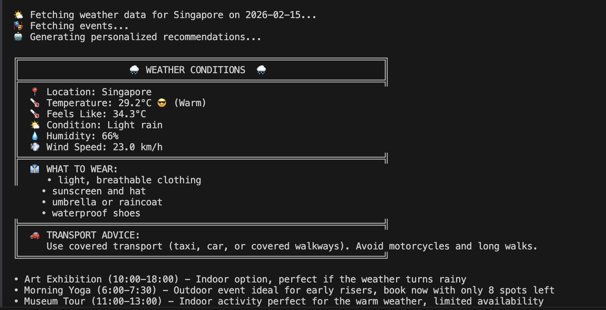

# Multi-Service Agent System for Event Recommendations

A sophisticated multi-agent system that combines weather data, event information, and AI-powered reasoning to provide personalized event recommendations.

---

## 📋 Table of Contents
- [Overview](#overview)
- [System Architecture](#system-architecture)
- [Design Approach](#design-approach)
- [Features](#features)
- [Installation](#installation)
- [Usage](#usage)
- [API Documentation](#api-documentation)
- [Technical Details](#technical-details)
- [Future Enhancements](#future-enhancements)

---

## 🎯 Overview

This system helps users discover and plan events by considering multiple factors:
- **Real-time Weather**: Current conditions, temperature, and forecasts
- **Event Database**: Comprehensive event information with filtering
- **AI Recommendations**: Intelligent suggestions using OpenAI GPT-4
- **Practical Advice**: What to wear, how to travel, when to book

### Key Benefits
- ✅ Weather-aware recommendations (indoor vs outdoor)
- ✅ Time-based scheduling (morning/afternoon/evening)
- ✅ Budget-conscious filtering
- ✅ Booking urgency alerts
- ✅ Visual, easy-to-read output with icons

### Sample Response

Here's what the system output looks like:



*The system provides a weather conditions box followed by concise, bullet-point event recommendations.*

---

## 🏗️ System Architecture

### Multi-Agent Design Pattern

The system uses a **multi-agent architecture** where specialized agents handle different responsibilities:

```
┌─────────────────────────────────────────────────────────────┐
│                    User Request                              │
│           (location, date, optional filters)                 │
└────────────────────┬────────────────────────────────────────┘
                     │
                     ▼
         ┌───────────────────────┐
         │  CoordinatorAgent     │  ← Orchestrates workflow
         │  (Facade Pattern)     │
         └───────────┬───────────┘
                     │
        ┌────────────┼────────────┐
        │            │            │
        ▼            ▼            ▼
  ┌─────────┐  ┌─────────┐  ┌──────────────┐
  │ Weather │  │  Event  │  │Recommendation│
  │  Agent  │  │  Agent  │  │    Agent     │
  └────┬────┘  └────┬────┘  └──────┬───────┘
       │            │               │
       ▼            ▼               ▼
   Weather API   SQLite DB      OpenAI API
   (External)    (Local)        (External)
```

### Agent Responsibilities

#### 1. **WeatherAgent** 🌤️
- Fetches real-time weather from WeatherAPI.com
- Generates clothing suggestions (what to wear)
- Provides transport recommendations (how to travel)
- Considers temperature AND weather conditions

#### 2. **EventAgent** 🎭
- Queries SQLite database for events
- Filters by: type (indoor/outdoor), time, price
- Groups events by time of day
- Finds alternative dates for events

#### 3. **RecommendationAgent** 🤖
- Uses OpenAI GPT-4 for intelligent recommendations
- Creates visual weather displays with icons
- Generates structured, explicit advice
- Combines all context into cohesive response

#### 4. **CoordinatorAgent** 🎯
- Central orchestrator (Facade pattern)
- Manages workflow and agent coordination
- Handles errors gracefully
- Provides simple API to users

---

## 🎨 Design Approach

### 1. Separation of Concerns
Each agent has a single, well-defined responsibility. This makes the system:
- **Maintainable**: Update one agent without affecting others
- **Testable**: Test each agent independently
- **Scalable**: Add new agents easily

### 2. Context-Aware Intelligence
The system doesn't just list events—it understands context:
- **Weather Impact**: Outdoor events in rain? System suggests alternatives
- **Timing**: Morning yoga at 6 AM mentioned? System explains why it's ideal
- **Availability**: Only 3 spots left? System emphasizes urgency
- **Budget**: Free events highlighted with 🎉 emoji

### 3. Explicit Communication
Following best practices for AI systems:
- **Clear Instructions**: AI receives structured prompts
- **Explicit Output**: Temperatures always include °C and description
- **Reasoning**: Every recommendation explains WHY
- **Visual Enhancement**: Icons for quick scanning

### 4. User-Centric Design
Focus on practical, actionable information:
- What to wear (displayed in weather box)
- How to travel (considering weather conditions)
- When to book (urgency alerts with 🔴 indicators)
- Concise, scannable bullet-point format (1-2 sentences per event)

---

## ✨ Features

### Weather Integration
- ☀️ Real-time weather from WeatherAPI.com
- 🌡️ Temperature with descriptive labels (Very Cold → Very Hot)
- 🥶 Temperature icons (freezing to hot)
- 👔 Clothing suggestions
- 🚗 Transport recommendations
- 💧 Humidity and wind information

### Event Filtering
- **Type**: Indoor 🏠 or Outdoor 🌳
- **Time**: Morning 🌅, Afternoon ☀️, Evening 🌙
- **Price**: Budget filtering with FREE 🎉 highlighting
- **Combined**: Apply multiple filters simultaneously

### Availability Tracking
- ✅ Good availability (>50% spots)
- ⚠️ Limited spots (20-50%)
- 🔴 Almost full (<20%) - BOOK NOW!
- ❌ Sold out

### AI-Powered Recommendations
Using OpenAI GPT-4 for:
- Weather suitability assessment
- Event matching with reasoning
- Concise, scannable bullet-point format
- Alternative suggestions when needed
- Booking urgency highlights (🔴 for critical bookings)

### Visual Enhancements
- Box drawing characters for structure
- Emoji icons throughout
- Color-coded urgency
- Clear section headers
- Easy-to-scan format

---

## 🚀 Installation

### Prerequisites
- Python 3.8 or higher
- pip (Python package manager)

### Step 1: Clone Repository
```bash
cd /path/to/multiservice_agent_system
```

### Step 2: Create Virtual Environment
```bash
python -m venv .venv
source .venv/bin/activate  # On Windows: .venv\Scripts\activate
```

### Step 3: Install Dependencies
```bash
pip install openai==0.28
pip install requests
pip install python-dotenv
```

### Step 4: Configure API Keys
Create a `.env` file in the project root:
```
OPENAI_API_KEY=your_openai_api_key_here
WEATHER_API_KEY=your_weather_api_key_here
```

**Get API Keys:**
- OpenAI: https://platform.openai.com/api-keys
- WeatherAPI: https://www.weatherapi.com/signup.aspx (free tier)

### Step 5: Initialize Database
```bash
python database.py
```
Output: `✅ Database created successfully with sample events!`

---

## 💻 Usage

### Basic Example
```python
from recommendation_system import CoordinatorAgent
import os
from dotenv import load_dotenv

load_dotenv()
WEATHER_API_KEY = os.getenv('WEATHER_API_KEY')
OPENAI_API_KEY = os.getenv('OPENAI_API_KEY')

# Initialize coordinator
coordinator = CoordinatorAgent(WEATHER_API_KEY, OPENAI_API_KEY)

# Get all events for a date
recommendations = coordinator.get_recommendations("Singapore", "2026-02-15")
print(recommendations)
```

### Filtering Examples

#### Filter by Time of Day
```python
# Morning events only (6:00 AM - 12:00 PM)
result = coordinator.get_recommendations(
    "Singapore", "2026-02-15", 
    time_of_day="morning"
)

# Evening events only (6:00 PM onwards)
result = coordinator.get_recommendations(
    "Singapore", "2026-02-16", 
    time_of_day="evening"
)
```

#### Filter by Price
```python
# Budget-friendly events (max $20)
result = coordinator.get_recommendations(
    "Singapore", "2026-02-15", 
    max_price=20
)

# Free events only
result = coordinator.get_recommendations(
    "Singapore", "2026-02-15", 
    max_price=0
)
```

#### Filter by Event Type
```python
# Indoor events only (good for rainy days)
result = coordinator.get_recommendations(
    "Singapore", "2026-02-16", 
    event_type="indoor"
)

# Outdoor events only (for nice weather)
result = coordinator.get_recommendations(
    "Singapore", "2026-02-15", 
    event_type="outdoor"
)
```

#### Combine Filters
```python
# Outdoor morning events under $15
result = coordinator.get_recommendations(
    "Singapore", "2026-02-15",
    event_type="outdoor",
    time_of_day="morning",
    max_price=15
)
```

### Running Test Examples
```bash
python recommendation_system.py
```

This runs 5 example scenarios:
1. All events on a date
2. Evening events only
3. Budget-friendly events
4. Indoor events only
5. No events available (error handling)

---

## 📚 API Documentation

### CoordinatorAgent

#### `__init__(weather_api_key, openai_api_key)`
Initialize the coordinator with API keys.

**Parameters:**
- `weather_api_key` (str): WeatherAPI.com API key
- `openai_api_key` (str): OpenAI API key

#### `get_recommendations(location, date, event_type=None, time_of_day=None, max_price=None)`
Get event recommendations for a location and date.

**Parameters:**
- `location` (str): City name (e.g., "Singapore", "London", "New York")
- `date` (str): Date in YYYY-MM-DD format
- `event_type` (str, optional): "indoor" or "outdoor"
- `time_of_day` (str, optional): "morning", "afternoon", or "evening"
- `max_price` (float, optional): Maximum price in USD

**Returns:**
- `str`: Formatted recommendation with weather box and AI response

**Example:**
```python
result = coordinator.get_recommendations(
    location="Singapore",
    date="2026-02-15",
    event_type="outdoor",
    time_of_day="morning",
    max_price=20
)
```

---

## 🔧 Technical Details

### Database Schema
```sql
CREATE TABLE events (
    id INTEGER PRIMARY KEY,
    name TEXT,
    type TEXT,              -- 'indoor' or 'outdoor'
    description TEXT,
    location TEXT,
    date TEXT,             -- YYYY-MM-DD
    start_time TEXT,       -- HH:MM
    end_time TEXT,         -- HH:MM
    price_min REAL,
    price_max REAL,
    capacity INTEGER,
    available_spots INTEGER
)
```

### Weather API Response Structure
```json
{
  "current": {
    "temp_c": 29.3,
    "feelslike_c": 34.3,
    "condition": {"text": "Partly cloudy"},
    "humidity": 66,
    "wind_kph": 15.5
  }
}
```

### Time Period Definitions
- **Morning**: 06:00 - 11:59
- **Afternoon**: 12:00 - 17:59
- **Evening**: 18:00 - 23:59

### Availability Thresholds
- **Good**: > 50% spots available
- **Limited**: 20% - 50% available
- **Almost Full**: < 20% available
- **Sold Out**: 0 spots available

---

## 🎓 Code Structure

```
multiservice_agent_system/
├── .env                          # API keys (DO NOT commit!)
├── .gitignore                    # Git ignore file
├── database.py                   # Database setup and initialization
├── recommendation_system.py      # Main system with all agents
├── events.db                     # SQLite database (auto-generated)
├── README.md                     # This file
├── ENHANCEMENTS.md              # Feature documentation
└── WEATHER_ICONS_GUIDE.md       # Icon reference
```

---

### Technical Improvements
- [ ] Caching for weather data (reduce API calls)
- [ ] Async operations for faster responses
- [ ] Database connection pooling
- [ ] Unit tests for all agents
- [ ] Integration tests for workflows
- [ ] API rate limiting
- [ ] Logging and monitoring
- [ ] Docker containerization
- [ ] Web interface (React/Flask)
---

## 📝 License

This project is for educational and demonstration purposes.


